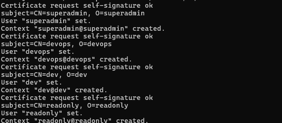
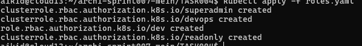
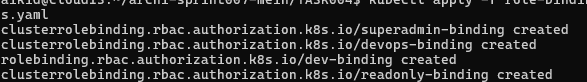
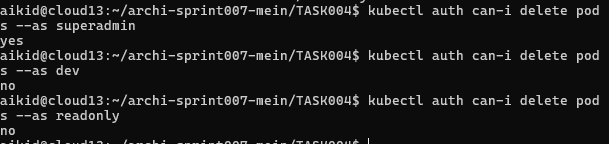

# Задание 4. Защита доступа к кластеру Kubernetes

В данном задании необходимо реализовать RBAC-модель (Role-Based Access Control) для пользователей Kubernetes-кластера.

Контекст и требования к ролевой модели (Role Model Requirements):
- Большинство бизнес-сервисов развертывается в K8s-среде (Kubernetes environment). Требуется ограничить доступ к управлению кластером для различных групп пользователей (user groups).
- Необходимо обеспечить защиту кластера путем предоставления привилегированных действий (privileged operations) - например, просмотра секретов (secrets access) - только определенным группам пользователей.
- Помимо привилегированных групп, необходимо выделить минимум две дополнительные группы пользователей: с правами только на просмотр ресурсов кластера (read-only access) и с возможностью конфигурирования кластера (cluster configuration).
- Требуется разграничить доступ к ресурсам кластера согласно организационной структуре компании (organizational structure).

### Техническое задание (Technical Requirements)

1. Развернуть пустой Minikube-кластер (Minikube cluster). Работа будет проводиться без тестового приложения, фокус на подготовке скриптов автоматизации (automation scripts), отражающих решения из предыдущих заданий.
2. Определить все роли и их полномочия (permissions) при работе с Kubernetes. Заполнить таблицу ролей (roles matrix): указать роли, их полномочия и соответствующие группы пользователей.
3. Подготовить скрипты создания пользователей (user creation scripts). Рекомендуется создать не менее двух пользователей.
4. Подготовить скрипты создания ролей (role creation scripts), соответствующих ролевой таблице.
5. Подготовить скрипты связывания пользователей с ролями (role binding scripts).

## Решение (Solution)

### 1. Матрица пользователей и ролей (Users & Roles Matrix)

| Роль (Role) | Права роли (Role Permissions) | Группы пользователей (User Groups) |
| --- | --- | --- |
| SuperAdmin | Полный доступ к кластеру (full cluster access) | IT administrator: team lead |
| DevOps | Управление деплоями сервисов, конфигураций (deployment & config management) | DevOps engineers |
| Dev | Управление подами без возможности удаления (pod management without deletion) | Dev engineers |
| ReadOnly | Просмотр ресурсов кластера (cluster resources view) | Security specialist |

### 2. Создание пользователей (User Creation)

Создание и аутентификация пользователей выполнено с использованием клиентских сертификатов X.509 (X.509 client certificates).

[Смотри скрипт создания пользователей (User Creation Script)](./create-users.sh)

### 3. Создание ролей (Role Creation)

[Смотри конфигурацию создания ролей (Role Configuration)](./roles.yaml)

### 4. Связывание ролей с пользователями (Role Binding)

[Смотри конфигурацию связывания ролей и пользователей (Role Binding Configuration)](./role-bindings.yaml)

### 5. Тестирование доступа (Access Testing)

Верификация корректности доступа пользователей согласно их ролям (role-based access verification).

- Команда `kubectl auth can-i delete pods` позволяет определить возможность выполнения пользователем определенного действия (permission check).

- `kubectl auth can-i delete pods --as dev` позволяет администратору выполнить impersonation для проверки прав пользователя (user impersonation for permission testing).

